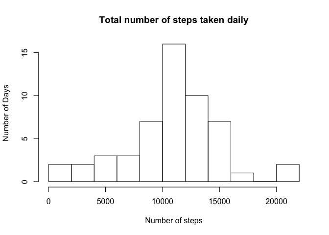
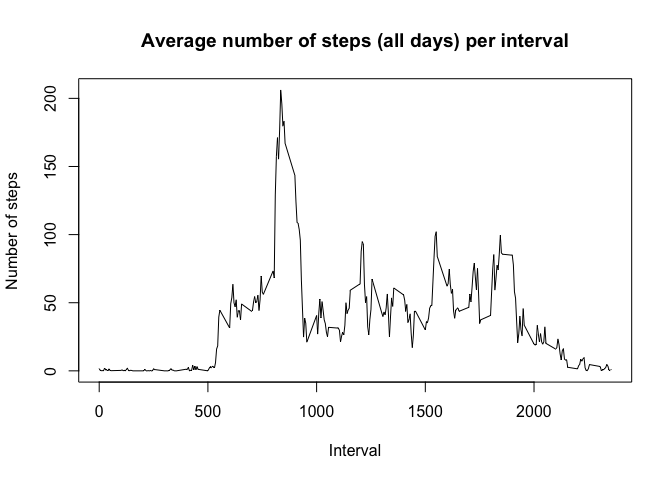
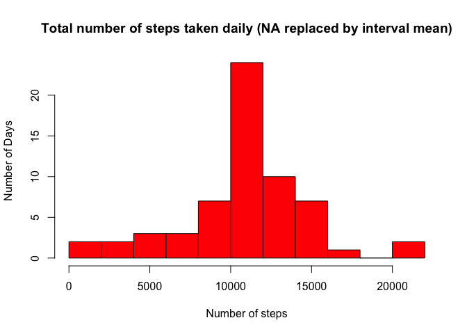
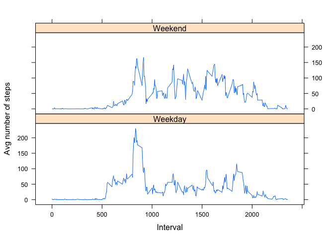

# Reproducible Research: Peer Assessment 1


## Loading and preprocessing the data

```r
activity.data<-read.csv('~/Documents/R Programming/Reproducible Research/activity.csv')
activity.data$date<-as.Date(as.character(activity.data$date),'%Y-%m-%d')
```
## What is mean total number of steps taken per day?  

**1. Calculate the total number of steps taken per day**  
  

```r
steps.perday<-aggregate(steps~date,activity.data,sum,na.rm=F)
print(steps.perday)
```

```
##          date steps
## 1  2012-10-02   126
## 2  2012-10-03 11352
## 3  2012-10-04 12116
## 4  2012-10-05 13294
## 5  2012-10-06 15420
## 6  2012-10-07 11015
## 7  2012-10-09 12811
## 8  2012-10-10  9900
## 9  2012-10-11 10304
## 10 2012-10-12 17382
## 11 2012-10-13 12426
## 12 2012-10-14 15098
## 13 2012-10-15 10139
## 14 2012-10-16 15084
## 15 2012-10-17 13452
## 16 2012-10-18 10056
## 17 2012-10-19 11829
## 18 2012-10-20 10395
## 19 2012-10-21  8821
## 20 2012-10-22 13460
## 21 2012-10-23  8918
## 22 2012-10-24  8355
## 23 2012-10-25  2492
## 24 2012-10-26  6778
## 25 2012-10-27 10119
## 26 2012-10-28 11458
## 27 2012-10-29  5018
## 28 2012-10-30  9819
## 29 2012-10-31 15414
## 30 2012-11-02 10600
## 31 2012-11-03 10571
## 32 2012-11-05 10439
## 33 2012-11-06  8334
## 34 2012-11-07 12883
## 35 2012-11-08  3219
## 36 2012-11-11 12608
## 37 2012-11-12 10765
## 38 2012-11-13  7336
## 39 2012-11-15    41
## 40 2012-11-16  5441
## 41 2012-11-17 14339
## 42 2012-11-18 15110
## 43 2012-11-19  8841
## 44 2012-11-20  4472
## 45 2012-11-21 12787
## 46 2012-11-22 20427
## 47 2012-11-23 21194
## 48 2012-11-24 14478
## 49 2012-11-25 11834
## 50 2012-11-26 11162
## 51 2012-11-27 13646
## 52 2012-11-28 10183
## 53 2012-11-29  7047
```
  
**2. Make a histogram of the total number of steps taken each day.**  


```r
hist(steps.perday$steps,breaks=10,main='Total number of steps taken daily',xlab='Number of steps',ylab='Number of Days')
```

<!-- -->
  
**3. Calculate and report the mean and median of the total number of steps taken per day**  


```r
steps.perday.mean<-mean(steps.perday$steps)
steps.perday.median<-median(steps.perday$steps)
```
  
**MEAN = **10766.19 (Average number of daily steps)  
**MEDIAN= **10765 (Median of the number of daily steps)  


## What is the average daily activity pattern?  

**1. Make a time serie plot...**  


```r
steps.interval<-aggregate(steps~interval,activity.data,na.rm=F,mean)
with(steps.interval,plot(interval,steps,type='l',xlab='Interval',ylab='Number of steps',main='Average number of steps (all days) per interval'))
```

<!-- -->

```r
max.interval<-steps.interval[which.max(steps.interval$steps),1]
```
  
**2. Which 5-minute interval, on average across all days, contains the maximum number of steps**  


```r
max.interval<-steps.interval[which.max(steps.interval$steps),1]
```
  
On average, interval **835** has the most steps with **206** steps  
  

## Imputing missing values  
  
**1. Number of missing values**  

```r
number.NA<-sum(is.na(activity.data))
mean.NA<-mean(is.na(activity.data))
```
  
There is **2304** missing values which represents **4 %** of missing values  

**2. Devise a strategy for filling the missing values**  

As suggested in the instruction, I decided to associate all NA values to the mean of that interval.  
**3. Create a new dataset with missing data filed**  


```r
imputed.activity.data<-merge(activity.data,steps.interval, by='interval')
NA.steps<-which(is.na(imputed.activity.data$steps.x))
imputed.activity.data$steps.x[NA.steps]<-round(imputed.activity.data$steps.y[NA.steps])
imputed.activity.data<-imputed.activity.data[,1:3]
imputed.daily.steps<-aggregate(steps.x~date,imputed.activity.data,sum)
```
  
**4. Make histogram**  


```r
mean.daily.steps<-mean(imputed.daily.steps$steps.x)
median.daily.steps<-median(imputed.daily.steps$steps.x)
hist(imputed.daily.steps$steps.x,col='red',breaks=10,main='Total number of steps taken daily (NA replaced by interval mean)',xlab='Number of steps',ylab='Number of Days')
```

<!-- -->
  
After replacing the the missing values, we realise that the difference is not signigicant. We could've ignored the NA datas.  

MEAN Diff% =(Ignored-Imputed)/Ignored = 0.0092883 %  

MEDIAN Diff% =(Ignored-Imputed)/Ignored = 0.0278681 %  
  
  
## Are there differences in activity patterns between weekdays and weekends?
  
**1. Create new Factor variable**  


```r
imputed.activity.data$weekday<-as.factor(weekdays(imputed.activity.data$date))
weekday.name<-c('Monday','Tuesday','Wednesday','Thursday','Friday')
imputed.activity.data$weekend<-ifelse(imputed.activity.data$weekday %in% weekday.name,'Weekday','Weekend')
imputed.interval.mean<-aggregate(steps.x~interval+weekend,imputed.activity.data,mean)
```
  
**2. Panel plot**
  

```r
library(lattice)
with(imputed.interval.mean,xyplot(steps.x~interval|weekend,type='l',ylab='Avg number of steps',xlab='Interval',layout=c(1,2)))
```

<!-- -->
  
The pattern is a little different at the steps per interval during the weekend seem more distributed
